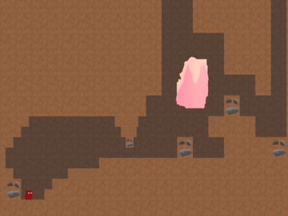

<!-- PROJECT LOGO -->
<br />
<p align="center">
    
  <h3 align="center">SuperMeatyMan</h3>
</p>

<!-- TABLE OF CONTENTS -->
## Table of Contents

* [About The Project](#about-the-project)
* [Gameplay Example](#gameplay-example)
* [Getting Started](#getting-started)
* [Plans](#plans)
* [Known Bugs](#bugs)


<!-- ABOUT THE PROJECT -->
## About The Project
A SuperMeatBoy inspired game which was created as a project for the course Advanced Programming given at UA.
Almost all the functionality is implemented from scratch, with the exception of using SFML inorder to draw to the screen and gather player input (no other functionality used).

The goal of the game is reaching the end of a level. The camera moves up when the player reaches 80% of the height.
If the player is no longer viewable (e.g. by falling of screen) the level is lost and the player can retry or go back to the menu.

The logic of the game is a seperate standalone library which can be found in src/logic.
This means you could implement your own code related to showing the visuals of the game,
in this version I used SFML for drawing to the screen so this means this library has to be installed inorder to build and execute.


<!-- GAMEPLAY EXAMPLE -->
## Gameplay Example

<br />
<p >
    
</p>

<br />
<p >
    
</p>


<!-- GETTING STARTED -->
## Getting Started

### Linux
Make sure you have CMake, Make installed and have a version of C++17 or higher installed.
SFML also has to be installed.

```bash
git clone "this repository"
cd SuperMeatyMan/src
cmake .
make
```
If all the required libraries/tools are installed the project should build.
In order to execute and play the game
```bash
./SuperMeatyMan
```
from inside the SuperMeatyMan/src/ folder.

<!-- PLANS -->
## Plans

Possibly implement the graphics library using OpenGL/Vulcan, removing the dependency of SFML.

<!-- BUGS -->
## Known Bugs

| Description                                                                                    | Status   | Priority |
| ---------------------------------------------------------------------------------------------- | --- | --- |
| Executable only works if executed from the place where it got build. (Because of relative paths used)                                             | Backlog   | Low | 
| Pressing ENTER after you died or won the level leaves the overlay on the screen. (ESC should be pressed instead of ENTER)                                                  | Backlog   | Low |
